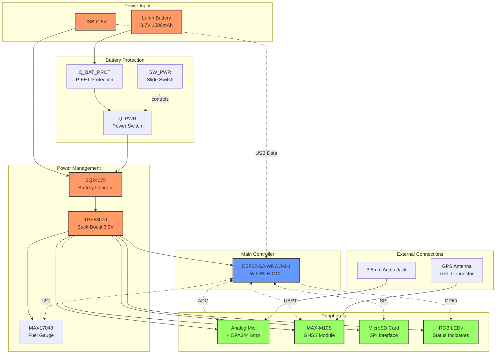
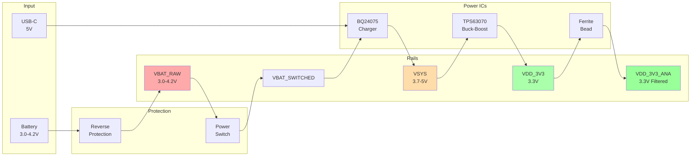

# ZF0001 Hardware Documentation

**Board:** Wearable Voice Logger  
**Revision:** A  
**Status:** ✅ Production Ready

---

## Overview

Compact wearable device that records audio, tags with GPS coordinates and battery data, and streams to a server via WiFi.

### Key Features
- **ESP32-S3-WROOM-1-N8R8**: WiFi/BLE, 8MB Flash, 8MB PSRAM
- **Analog Microphone**: 3.5mm jack with OPA344 amplification (26dB gain)
- **GPS Tagging**: u-blox MAX-M10S GNSS module
- **Battery Management**: Li-Ion charger + fuel gauge
- **USB-C Programming**: Native USB (no external chip needed)
- **Local Backup**: MicroSD card (optional)
- **Visual Feedback**: RGB LEDs + power LED

---

## System Architecture

---

## Power Management

### Power Flow Diagram

### Power Rails

| Rail | Voltage | Source | Purpose |
|------|---------|--------|---------|
| **VBAT_RAW** | 3.0-4.2V | Battery | Always-on (fuel gauge monitoring only) |
| **VBAT_SWITCHED** | 3.0-4.2V | Via switch | Battery to charger |
| **VSYS** | 3.7-5V | BQ24075 | Charger output (USB or battery) |
| **VDD_3V3** | 3.3V | TPS63070 | Main system power |
| **VDD_3V3_ANA** | 3.3V | Filtered | Microphone circuit only |

### Battery Life (1500mAh)
- **Active streaming:** ~6.7 hours
- **Idle with WiFi:** ~18 hours

---

## GPIO Pin Map

| GPIO | Function | Type | Notes |
|------|----------|------|-------|
| 0 | Boot Button | Input | For bootloader mode |
| 1 | Microphone | ADC1_CH0 | 0-2.45V analog input |
| 2 | Record Button | Input | Start/stop recording |
| 4 | LED Red | Output | RGB status |
| 5 | LED Green | Output | RGB status |
| 6 | LED Blue | Output | RGB status |
| 7 | Charge Status | Input | From BQ24075 (active low) |
| 8 | Power Good | Input | From BQ24075 (active low) |
| 9 | Fuel Gauge Alert | Input | From MAX17048 (active low) |
| 10 | SD CS | SPI2 | Chip select |
| 11 | SD MOSI | SPI2 | SPI data out |
| 12 | SD CLK | SPI2 | SPI clock |
| 13 | SD MISO | SPI2 | SPI data in |
| 14 | SD Detect | Input | Card detect |
| 15 | GPS TX | UART1 | ESP32 TX → GNSS RX |
| 16 | GPS RX | UART1 | ESP32 RX ← GNSS TX |
| 19 | USB D- | USB | Native USB programming |
| 20 | USB D+ | USB | Native USB programming |
| 21 | I2C SDA | I2C | Fuel gauge data |
| 47 | I2C SCL | I2C | Fuel gauge clock |
| EN | Reset | Input | SW_RESET button |

---

## Critical Design Notes

### 1. I2C Voltage Levels (CRITICAL!)
- **I2C pull-ups to VDD_3V3 (3.3V)** - NOT VBAT_RAW!
- ESP32-S3 GPIO max input: VDD + 0.3V = 3.6V
- VBAT_RAW can be 4.2V (exceeds spec)
- Fuel gauge VCC also on VDD_3V3 to match I2C domain
- **Trade-off:** Fuel gauge loses memory when power OFF, but GPIOs are safe

### 2. Buck-Boost Converter
- TPS63070 works from 2.0-16V input
- Supports full battery discharge (3.0V to 4.2V)
- Better than buck converter (TPS62933 needs 3.8V minimum)

### 3. Battery Protection
- Q_BAT_PROT gate to GND (Vgs = -3.7V for full conduction)
- Reverse polarity protection via body diode
- Minimal voltage drop (~70mΩ)

### 4. Power Switch
- Switches battery to charger input (not output)
- Cleaner power control
- Prevents charger interaction when OFF

---

## Component BOM

| Component | Part Number | Function |
|-----------|-------------|----------|
| U_MCU | ESP32-S3-WROOM-1-N8R8 | Main controller |
| U_CHARGER | BQ24075RGTR | Battery charger |
| U_BUCKBOOST | TPS63070RNMR | 3.3V buck-boost |
| U_FUELGAUGE | MAX17048X+T10 | Battery monitor |
| U_GNSS | MAX-M10S-00B | GPS module |
| U_OPAMP | OPA344NA/250 | Mic amplifier |
| Q_BAT_PROT, Q_PWR | DMG2305UX-7 | P-FET switches (×2) |
| J_USB | HRO TYPE-C-31-M-12 | USB-C connector |
| J_BAT | S2B-PH-K-S | Battery connector |
| J_MIC | SJ-3524-SMT-TR | 3.5mm audio jack |
| J_SD | MSD-12-A | MicroSD socket |
| SW_PWR | CSS-1210TB | Slide switch |
| SW_BOOT, SW_RESET, SW_RECORD | SKRKAHE020 | Tactile buttons (×3) |
| Passives | Various | ~50 resistors, caps, inductors |

**Estimated BOM:** $25-35 per board

---

## Test Points

| TP | Net | Expected Voltage |
|----|-----|------------------|
| TP_VBAT | VBAT_RAW | 3.0-4.2V |
| TP_VSYS | VSYS | 3.7-5V |
| TP_3V3 | VDD_3V3 | 3.3V |
| TP_I2C_SDA | I2C SDA | 3.3V (when idle high) |
| TP_I2C_SCL | I2C SCL | 3.3V (when idle high) |
| TP_GND | GND | 0V |

---

## Specifications

### Power
- **Input:** Li-Ion 3.7V (1000-2000mAh) OR USB-C 5V
- **Charging:** 800mA max via BQ24075
- **System:** 3.3V @ 2A from TPS63070
- **Efficiency:** 90-95%

### Audio
- **Input:** 3.5mm TRS jack (electret microphone)
- **Amplification:** 26dB (OPA344 op-amp)
- **ADC:** 12-bit @ 16kHz
- **Signal Range:** 200mV-2V (after amp)

### GPS
- **Module:** u-blox MAX-M10S
- **Interface:** UART @ 9600 baud
- **Satellites:** GPS, GLONASS, Galileo, BeiDou
- **Acquisition:** ~30s cold start

### Battery
- **Monitor:** MAX17048 fuel gauge
- **Interface:** I2C @ 0x36
- **Accuracy:** ±1% (after learning)

### Physical
- **Size:** ~40mm × 50mm × 10mm (target)
- **Layers:** 4-layer PCB
- **Connectors:** USB-C, JST-PH, 3.5mm, u.FL, microSD

---

**For programming and debugging, see QUICKSTART.md**
