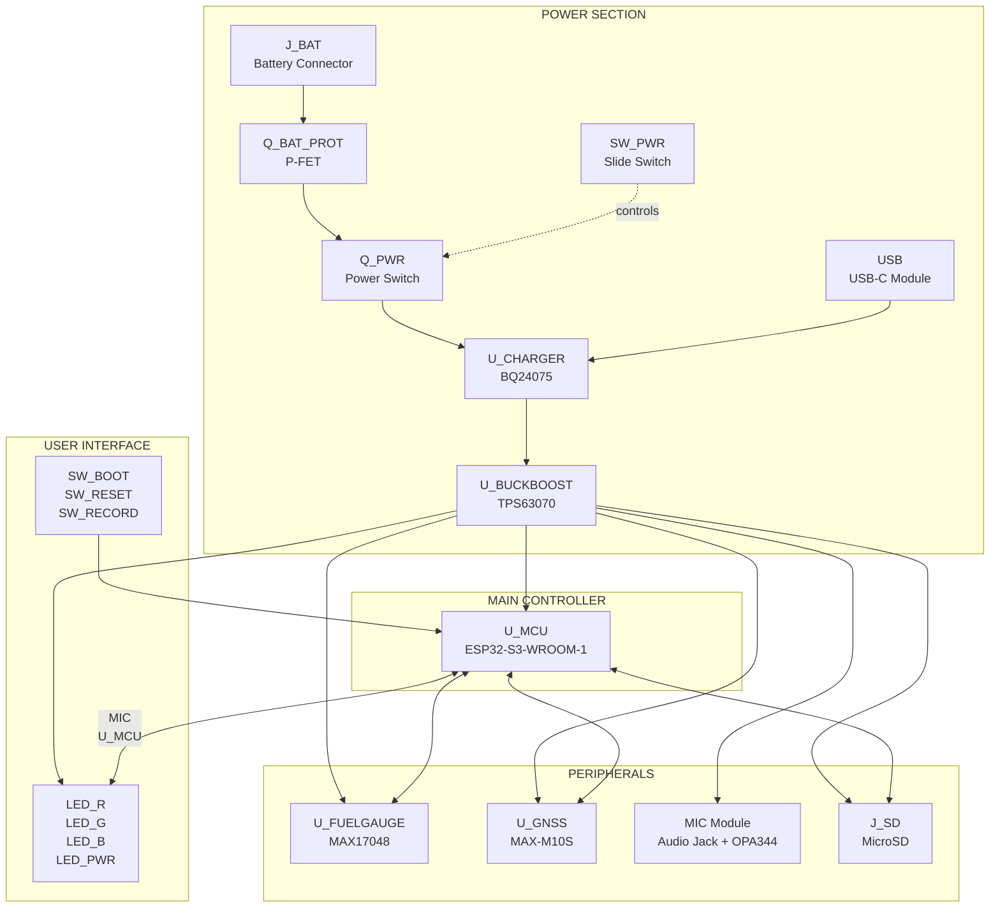
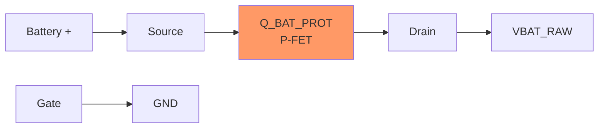
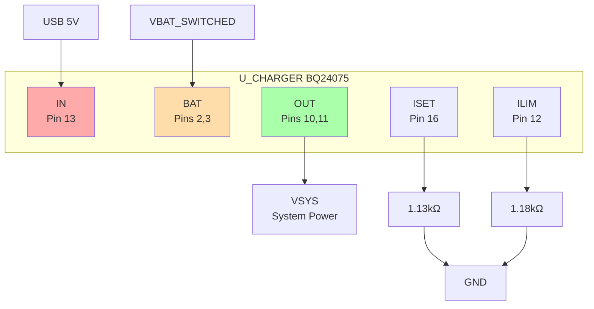
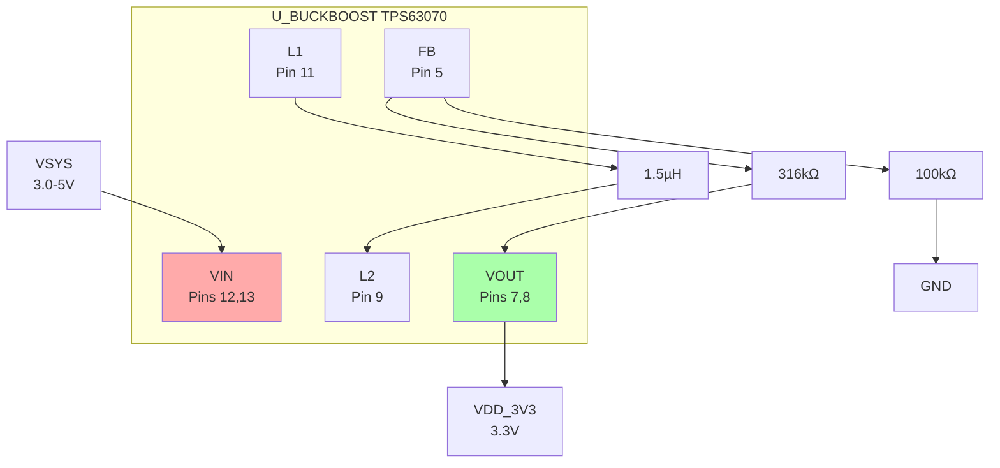
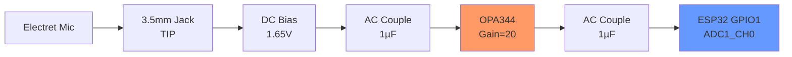
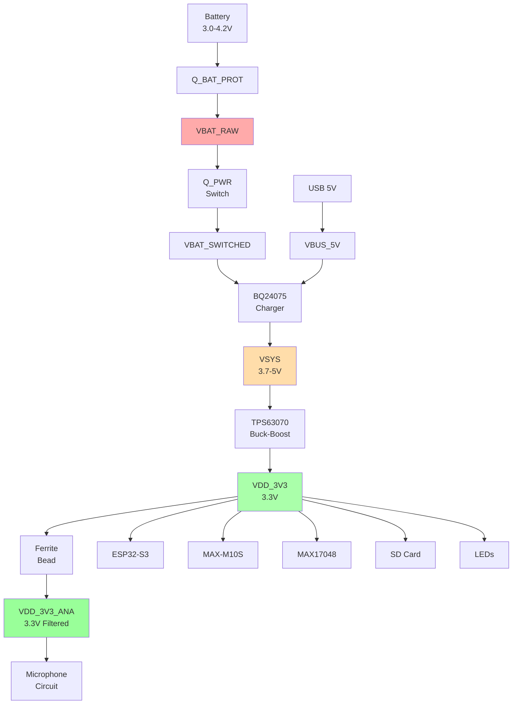

# ZF0001 Schematic Build Guide

**Complete pin-by-pin assembly instructions**

---

## Overview - System Block Diagram



---

## Power Section (Build First)

### 1. Battery Connector - J_BAT (S2B-PH-K-S)

```
Component: J_BAT
Part: S2B-PH-K-S (JST-PH 2-pin)

Connections:
Pin 1 (P1) → Net: VBAT_UNFUSED (before fuse)
Pin 2 (P2) → GND
```

**Battery Overcurrent Protection - F_BAT:**
```
Component: F_BAT
Part: 0Ω resistor footprint (1206) or PPTC fuse

Connections:
P1 → VBAT_UNFUSED (from battery)
P2 → VBAT_INPUT (to protection FET)

Recommended PPTC: Littelfuse 0ZCJ0200FF2E (2A hold, 4A trip)
Note: Can populate with 0Ω resistor if overcurrent protection not needed
```

### 2. Battery Protection - Q_BAT_PROT (DMG2305UX-7)

```
Component: Q_BAT_PROT  
Part: DMG2305UX-7 (P-channel MOSFET, SOT-23)

Pinout (SOT-23):
Pin 1: Gate (G)
Pin 2: Source (S)  
Pin 3: Drain (D)

Connections:
G (Pin 1) → GND                    ← CRITICAL: Gate to ground!
S (Pin 2) → VBAT_INPUT             ← From battery connector
D (Pin 3) → VBAT_RAW               ← Protected battery output

Purpose: Reverse polarity protection via body diode
```



### 3. Power Switch - SW_PWR + Q_PWR

**Slide Switch - SW_PWR (CSS-1210TB):**
```
Component: SW_PWR
Part: CSS-1210TB (SPDT slide switch)

Connections:
Pin 1 (P1)  → GND
Pin 2 (P2)  → SW_GATE (common/wiper)
Pin 3 (P3)  → VBAT_RAW
MH1, MH2    → GND (mounting holes)
```

**Power Switch P-FET - Q_PWR (DMG2305UX-7):**
```
Component: Q_PWR
Part: DMG2305UX-7

Connections:
G (Pin 1) → SW_GATE                ← Controlled by slide switch
S (Pin 2) → VBAT_RAW               ← From protected battery
D (Pin 3) → VBAT_SWITCHED          ← To charger battery input
```

**Gate Pull-up - R_GATE_PU:**
```
Component: R_GATE_PU
Value: 100kΩ 5%
Package: 0402

P1 → VBAT_RAW
P2 → SW_GATE

Purpose: Pulls gate HIGH (OFF) when switch is open
```

**Operation:**
```
Switch LEFT  → SW_GATE = GND         → Vgs=-3.7V → P-FET ON  → System ON
Switch RIGHT → SW_GATE = VBAT_RAW    → Vgs=0V    → P-FET OFF → System OFF
```

### 4. USB-C Connector - USB Module

```
Component: USB (UsbC module from registry)
Instantiation:
    name = "USB"
    config_usb_type = "USB2_SINK"
    config_use_usb_power = True
    vusb = VBUS_5V      ← Create this power rail
    usb2 = usb_data     ← Create Usb2("USB_DATA")
    gnd = GND

This module includes:
- HRO TYPE-C-31-M-12 connector
- 2× 5.1kΩ CC resistors (for USB2 sink)
- TPD4E05U06QDQARQ1 (ESD protection on D+/D-)
- SMF6.0CA (TVS diode on VBUS)
```

### 5. Battery Charger - U_CHARGER (BQ24075RGTR)

```
Component: U_CHARGER
Part: BQ24075RGTR (QFN-16, 3mm×3mm)

Power Connections:
Pin 13 (IN)      → VBUS_5V          ← From USB-C
Pin 2,3 (BAT)    → VBAT_SWITCHED    ← From power switch
Pin 10,11 (OUT)  → VSYS             ← System power output
Pin 1 (VSS)      → GND
Pin 15 (GND)     → GND              ← Thermal pad

Programming Resistors (all to GND):
Pin 16 (ISET) → R_ISET (1.13kΩ 1%) → GND    [800mA charge current]
Pin 12 (ILIM) → R_ILIM (1.18kΩ 1%) → GND    [1.3A input limit]
Pin 14 (TMR)  → R_TMR (46.4kΩ 5%) → GND     [6.25hr timer]
Pin 8 (TS)    → R_TS (10kΩ 5%) → GND         [NTC disabled]

Control Pins (all with 100kΩ to GND):
Pin 4 (CE)     → R_CE (100kΩ) → GND          [Charge enabled]
Pin 6 (EN1)    → R_EN1 (100kΩ) → GND         [EN1=0, EN2=0 = ILIM mode]
Pin 5 (EN2)    → R_EN2 (100kΩ) → GND
Pin 14 (SYSOFF) → R_SYSOFF (100kΩ) → GND    [Normal operation]

Status Outputs (open-drain, need pull-ups):
Pin 9 (CHG)    → R_CHG (100kΩ) → VSYS → Gpio("CHG_STAT")
Pin 7 (PGOOD)  → R_PG (100kΩ) → VSYS → Gpio("PG_STAT")

Bypass Capacitors:
C_IN:  10µF 10V 0805, IN to GND
C_BAT: 10µF 10V 0805, BAT to GND  
C_SYS: 10µF 10V 0805, OUT to GND
```



### 6. Buck-Boost Converter - U_BUCKBOOST (TPS63070RNMR)

```
Component: U_BUCKBOOST
Part: TPS63070RNMR (VQFN-15, 2.5mm×3mm)

Power Connections:
Pin 12,13 (VIN)   → VSYS            ← From charger
Pin 7,8 (VOUT)    → VDD_3V3         ← 3.3V output
Pin 4 (GND)       → GND             ← Logic ground
Pin 10 (PGND)     → GND             ← Power ground (thermal)

Inductor:
Pin 11 (L1) ──┐
              ├── L_MAIN (1.5µH, 4A, 1210)
Pin 9 (L2)  ──┘

Feedback Divider (for 3.3V output):
Pin 5 (FB) → R_FBT (316kΩ 1%) → VOUT
           → R_FBB (100kΩ 1%) → GND
NOTE: V_FB = 0.8V reference!

Control Pins:
Pin 14 (EN)    → R_EN (100kΩ) → VSYS → Gpio("BUCKBOOST_EN")
Pin 2 (PG)     → R_PG (100kΩ) → VOUT → Gpio("BUCKBOOST_PG")
Pin 1 (PS/S)   → R_PS (100kΩ) → VSYS  [Auto PWM/PFM mode]
Pin 15 (VSEL)  → R_VSEL (0Ω) → GND    [Voltage scaling disabled]
Pin 6 (FB2)    → R_FB2 (0Ω) → GND     [Not used]

VAUX (Internal LDO):
Pin 3 (VAUX) → C_VAUX (100nF 0402) → GND

Bypass Capacitors:
C_IN:   10µF 25V 0805, VIN to GND
C_OUT1: 47µF 10V 1206, VOUT to GND
C_OUT2: 47µF 10V 1206, VOUT to GND
```



---

## ESP32-S3 Section

### 7. Main Controller - U_MCU (ESP32-S3-WROOM-1-N8R8)

```
Component: U_MCU
Part: ESP32-S3-WROOM-1-N8R8 (41-pin module)

Power Pins:
Pin 2 (3V3)     → VDD_3V3
Pin 1,40,41 (GND+EPAD) → GND (all 11 GND pins)
  - Pins: 1, 15, 18, 21, 23, 28, 31, 34, 37, 40, 41 (EPAD)

Control Pins:
Pin 3 (EN)      → Gpio("ESP_EN") with R_EN (10kΩ) + C_EN (1µF) to GND

USB Pins:
Pin 13 (IO19)   → usb_data.DM (USB D-)
Pin 14 (IO20)   → usb_data.DP (USB D+)

Boot Pins:
Pin 27 (IO0)    → Gpio("ESP_BOOT") with R_GPIO0 (10kΩ to VDD_3V3)

GPIO Assignments (pin → signal):
Pin 39 (IO1)   → Gpio("MIC_IN")         # ADC1_CH0 for microphone
Pin 38 (IO2)   → Gpio("BTN_RECORD")     # Record button input
Pin 4 (IO4)    → Gpio("LED_R")          # Red LED output
Pin 5 (IO5)    → Gpio("LED_G")          # Green LED output  
Pin 6 (IO6)    → Gpio("LED_B")          # Blue LED output
Pin 7 (IO7)    → Gpio("CHG_STAT")       # Charger status input
Pin 12 (IO8)   → Gpio("PG_STAT")        # Power good input
Pin 17 (IO9)   → Gpio("FG_ALERT")       # Fuel gauge alert input
Pin 18 (IO10)  → spi_sd.CS              # SD card chip select
Pin 19 (IO11)  → spi_sd.MOSI            # SD card MOSI
Pin 20 (IO12)  → spi_sd.CLK             # SD card clock
Pin 21 (IO13)  → spi_sd.MISO            # SD card MISO
Pin 22 (IO14)  → Gpio("SD_DETECT")      # SD card detect
Pin 8 (IO15)   → uart_gnss.TX           # GPS UART TX (ESP→GNSS)
Pin 9 (IO16)   → uart_gnss.RX           # GPS UART RX (ESP←GNSS)
Pin 23 (IO21)  → i2c_main.SDA           # I2C data
Pin 24 (IO47)  → i2c_main.SCL           # I2C clock

PSRAM Pins (DO NOT USE):
Pin 28 (IO35) → Internal PSRAM
Pin 29 (IO36) → Internal PSRAM  
Pin 30 (IO37) → Internal PSRAM

Unused Pins (leave as NC):
Pin 15 (IO3)   → Will have 10kΩ pull-up in ESP32S3WROOM1x module
Pin 26 (IO45)  → Internal pull-down (VDD_SPI strapping)
Pin 16 (IO46)  → Internal pull-down (ROM print strapping)
```

**Module Internal Connections (ESP32S3WROOM1x.zen adds):**
- R_EN: 10kΩ from VDD_3V3 to EN
- C_EN: 1µF from EN to GND
- R_GPIO0: 10kΩ from VDD_3V3 to IO0
- R_GPIO3_STRAP: 10kΩ from VDD_3V3 to IO3
- C_VDD1: 10µF from VDD_3V3 to GND
- C_VDD2,3: 100nF from VDD_3V3 to GND

### 8. Boot/Reset Buttons

```
SW_BOOT:
Component: SW_BOOT
Part: SKRKAHE020 (Tactile button)
P1 → Gpio("ESP_BOOT") (already has pull-up)
P2 → GND

SW_RESET:
Component: SW_RESET  
Part: SKRKAHE020
P1 → Gpio("ESP_EN") (already has pull-up in module)
P2 → GND
```

---

## I2C Section

### 9. I2C Bus Configuration

```
Create I2C interface: i2c_main = I2c("I2C_MAIN")

Pull-up Resistors (CRITICAL - pull to VDD_3V3, NOT VBAT_RAW):
R_I2C_SDA: 4.7kΩ 5% 0402
    P1 → i2c_main.SDA
    P2 → VDD_3V3

R_I2C_SCL: 4.7kΩ 5% 0402
    P1 → i2c_main.SCL  
    P2 → VDD_3V3
```

### 10. Fuel Gauge - U_FUELGAUGE (MAX17048X+T10)

```
Component: U_FUELGAUGE
Part: MAX17048X+T10 (8-WLCSP, 1.66mm×0.92mm)

Pinout (BGA):
A1: CTG
A2: CELL
A3: VDD
A4: GND
B1: SDA
B2: SCL
B3: QSTRT
B4: ALRT

Connections:
A1 (CTG)   → C_CTG (100nF 0402) → GND
A2 (CELL)  → VBAT_RAW               ← Monitors battery directly
A3 (VDD)   → VDD_3V3                ← CRITICAL: Not VBAT_RAW!
A4 (GND)   → GND
B1 (SDA)   → i2c_main.SDA           ← To ESP32 GPIO21
B2 (SCL)   → i2c_main.SCL           ← To ESP32 GPIO47
B3 (QSTRT) → Leave floating          [Quick start, auto mode]
B4 (ALRT)  → Gpio("FG_ALERT")       ← To ESP32 GPIO9 (no external pull-up)

Bypass:
C_VDD: 100nF 0402, VDD to GND

NOTE: VDD on VDD_3V3 (not VBAT_RAW) to match I2C pull-up domain!
      This prevents ESP32 GPIO overvoltage (4.2V > 3.6V max spec)
```

---

## GPS Section

### 11. GNSS Module - U_GNSS (MAX-M10S-00B)

```
Component: U_GNSS
Part: MAX-M10S-00B (LGA-18)

Power Pins:
Pin 8 (VCC)      → VDD_3V3
Pin 7 (V_IO)     → Via R_VIO (0Ω) to VCC  [Tied together for 3.3V]
Pin 6 (V_BCKP)   → NOT CONNECTED           [Would exceed 3.6V spec]
Pin 14 (VCC_RF)  → C_VCCRF (100nF) → GND  [For active antenna]
Pin 1,10,12 (GND) → GND (all 3 GND pins)

UART:
Pin 2 (TXD)      → uart_gnss.TX            ← GNSS transmits to ESP32 GPIO16
Pin 3 (RXD)      → uart_gnss.RX            ← GNSS receives from ESP32 GPIO15

RF:
Pin 11 (RF_IN)   → u.FL connector (in module)

Control (optional, connected but not used in firmware):
Pin 9 (RESET_N)  → Gpio("GNSS_RESET")     [Has internal pull-up, can leave]
Pin 4 (TIMEPULSE)→ Gpio("GNSS_PPS")       [Time pulse output]

I2C (not used):
Pin 16 (SDA)     → Leave open
Pin 17 (SCL)     → Leave open

Special Pins:
Pin 18 (SAFEBOOT_N) → Leave open          [Normal boot]
Pin 15 (VIO_SEL)    → Leave open          [3.3V mode]
Pin 5 (EXTINT)      → Leave open
Pin 13 (LNA_EN)     → Leave open          [Controls internal/external LNA]
Pin ? (RESERVED)    → Leave floating      [Per datasheet]

Module adds (MAXM10Sx.zen):
- R_VIO: 0Ω from VCC to V_IO
- C_VCC1: 10µF VCC to GND
- C_VCC2: 100nF VCC to GND
- C_VCCRF: 100nF VCC_RF to GND
```

---

## Audio Section

### 12. Analog Power Filtering

```
Ferrite Bead - FB_ANA:
Component: FB_ANA
Value: 10µH 500mA 0805
P1 → VDD_3V3
P2 → VDD_3V3_ANA

Filter Cap - C_ANA_FILT:
Value: 10µF 10V 0805
P1 → VDD_3V3_ANA
P2 → GND

Purpose: Isolates analog circuit from digital switching noise
```

### 13. Microphone Input - MIC Module (AnalogMicInput)

**Audio Jack - J_MIC (SJ-3524-SMT-TR):**
```
Component: J_MIC (inside MIC module)
Part: SJ-3524-SMT-TR (3.5mm TRS jack)

Pin 2 (TIP)    → _MIC_IN             ← Microphone signal
Pin 3 (RING)   → GND                 [Not used for mono]
Pin 1 (SLEEVE) → GND
Pin 4 (TIP_SW) → Leave NC            [Tip switch not used]
Pin 5,6        → GND                 [Mechanical ground]
```

**Microphone Bias Network:**
```
R_BIAS1: 2.2kΩ 5% 0402
    P1 → VDD_3V3_ANA
    P2 → _MIC_BIAS

R_BIAS2: 2.2kΩ 5% 0402
    P1 → _MIC_BIAS
    P2 → GND

C_BIAS: 10µF 10V 0805
    P1 → _MIC_BIAS
    P2 → GND

Result: MIC_BIAS = 1.65V (VDD/2)

R_MIC: 2.2kΩ 5% 0402
    P1 → _MIC_BIAS
    P2 → _MIC_IN

Purpose: Provides DC bias voltage to electret microphone
```

**AC Coupling:**
```
C_AC: 1µF 10V 0402
    P1 → _MIC_IN
    P2 → _MIC_AC

R_IN: 10kΩ 5% 0402
    P1 → _MIC_AC
    P2 → _OPAMP_VREF
```

**Op-Amp Reference (Virtual Ground):**
```
R_VREF1: 10kΩ 5% 0402
    P1 → VDD_3V3_ANA
    P2 → _OPAMP_VREF

R_VREF2: 10kΩ 5% 0402
    P1 → _OPAMP_VREF
    P2 → GND

C_VREF: 10µF 10V 0805
    P1 → _OPAMP_VREF
    P2 → GND

Result: OPAMP_VREF = 1.65V (VDD/2)
```

**Op-Amp - U_OPAMP (OPA344NA/250):**
```
Component: U_OPAMP (inside MIC module)
Part: OPA344NA/250 (SOT-23-5)

Pinout:
Pin 1: OUT
Pin 2: V- (VM)
Pin 3: +IN (PIN)
Pin 4: -IN (MIN)
Pin 5: V+ (VP)

Connections:
Pin 5 (V+)  → VDD_3V3_ANA
Pin 2 (V-)  → GND
Pin 3 (+IN) → _MIC_AC               ← Input signal
Pin 4 (-IN) → _OPAMP_NEG            ← Feedback
Pin 1 (OUT) → _OPAMP_OUT

Decoupling:
C_OPAMP: 100nF 0402, V+ to GND
```

**Gain Network (Non-inverting, Gain=20):**
```
R_GAIN1: 19kΩ 1% 0402
    P1 → _OPAMP_OUT
    P2 → _OPAMP_NEG

R_GAIN2: 1kΩ 1% 0402
    P1 → _OPAMP_NEG
    P2 → _OPAMP_VREF

Gain = 1 + R_GAIN1/R_GAIN2 = 1 + 19/1 = 20 (26dB)
```

**Output to ADC:**
```
C_OUT: 1µF 10V 0402
    P1 → _OPAMP_OUT
    P2 → mic_out

R_OUT: 10kΩ 5% 0402
    P1 → mic_out
    P2 → GND

mic_out → Connects to Gpio("MIC_IN") = ESP32 GPIO1
```

**Complete Audio Signal Chain:**


---

## SD Card Section

### 14. MicroSD Socket - J_SD (MSD-12-A)

```
Component: J_SD
Part: MSD-12-A (MicroSD connector)

Power:
Pin 4 (VDD) → VDD_3V3
Pin 6 (VSS) → GND
Pin 9-15 (GND shields) → GND (all 7 ground pins)

SPI Connections (in SPI mode):
Pin 5 (CLK)     → spi_sd.CLK        ← ESP32 GPIO12
Pin 3 (CMD)     → spi_sd.MOSI       ← ESP32 GPIO11 (CMD in SD = MOSI in SPI)
Pin 2 (CD/DAT3) → spi_sd.CS         ← ESP32 GPIO10 (DAT3 in SD = CS in SPI)
Pin 7 (DAT0)    → spi_sd.MISO       ← ESP32 GPIO13 (DAT0 in SD = MISO in SPI)
Pin 8 (DAT1)    → Net("SD_DAT1")    [Not used in SPI mode]
Pin 1 (DAT2)    → Net("SD_DAT2")    [Not used in SPI mode]
Pin CD1 (detect)→ Gpio("SD_DETECT") ← ESP32 GPIO14

Pull-up Resistors (all to VDD_3V3):
R_SD_CS:     10kΩ 5% 0402, CS to VDD_3V3
R_SD_DAT1:   47kΩ 5% 0402, DAT1 to VDD_3V3
R_SD_DAT2:   47kΩ 5% 0402, DAT2 to VDD_3V3
R_SD_DETECT: 47kΩ 5% 0402, SD_DETECT to VDD_3V3
```

---

## User Interface

### 15. Record Button

```
R_BTN_RECORD: 10kΩ 5% 0402
    P1 → VDD_3V3
    P2 → Gpio("BTN_RECORD")

SW_RECORD:
Part: SKRKAHE020
    P1 → Gpio("BTN_RECORD")
    P2 → GND

Logic: Normally HIGH (pulled up), LOW when pressed
```

### 16. RGB LEDs (Common-Cathode)

**Red LED:**
```
R_LED_R: 150Ω 5% 0402
    P1 → Gpio("LED_R")           ← ESP32 GPIO4
    P2 → LED_R_ANODE

LED_R: Red 0603
    A (Anode)  → LED_R_ANODE
    K (Cathode)→ GND

Current: (3.3V - 2.0V) / 150Ω = 8.7mA
```

**Green LED:**
```
R_LED_G: 47Ω 5% 0402
    P1 → Gpio("LED_G")           ← ESP32 GPIO5
    P2 → LED_G_ANODE

LED_G: Green 0603
    A → LED_G_ANODE
    K → GND

Current: (3.3V - 3.0V) / 47Ω = 6.4mA
```

**Blue LED:**
```
R_LED_B: 47Ω 5% 0402
    P1 → Gpio("LED_B")           ← ESP32 GPIO6
    P2 → LED_B_ANODE

LED_B: Blue 0603
    A → LED_B_ANODE
    K → GND

Current: (3.3V - 3.0V) / 47Ω = 6.4mA
```

**Power LED:**
```
R_LED_PWR: 150Ω 5% 0402
    P1 → VDD_3V3                 ← Always-on indicator
    P2 → LED_PWR_ANODE

LED_PWR: Green 0603
    A → LED_PWR_ANODE
    K → GND

Current: (3.3V - 3.0V) / 150Ω = 2mA
```

---

## Bulk Decoupling

### 17. Power Rail Bulk Capacitors

```
C_BULK_3V3: 100µF 10V 1206
    P1 → VDD_3V3
    P2 → GND

C_BULK_VSYS: 47µF 10V 0805
    P1 → VSYS
    P2 → GND

C_BULK_VBAT: 10µF 10V 0805
    P1 → VBAT_RAW
    P2 → GND

Purpose: Low-frequency energy storage, reduce voltage ripple
```

---

## Test Points

### 18. Test Points (6 total)

```
All test points: variant = "Pad_D1.0mm"

TP_VBAT:     P1 → VBAT_RAW
TP_VSYS:     P1 → VSYS
TP_3V3:      P1 → VDD_3V3
TP_I2C_SDA:  P1 → i2c_main.SDA
TP_I2C_SCL:  P1 → i2c_main.SCL
TP_GND:      P1 → GND

Purpose: Debugging with multimeter/oscilloscope
```

---

## Power Rail Summary



---

## Component Placement Recommendations

### Critical Placement Rules:

**1. Power Section (Bottom-Left):**
```
[J_BAT] → [Q_BAT_PROT] → [SW_PWR + Q_PWR] → [U_CHARGER BQ24075]
Keep short, wide traces (0.5mm+)
```

**2. Buck-Boost (Center-Left):**
```
[U_BUCKBOOST TPS63070]
- Place L_MAIN inductor <5mm from L1/L2 pins
- C_OUT caps <5mm from VOUT pins
- Keep switching node (L1/L2) traces short
```

**3. ESP32 (Center):**
```
[U_MCU ESP32-S3]
- Orient antenna towards board edge (top-right)
- 5mm keep-out zone around antenna
- USB connector near GPIO19/20
```

**4. Microphone (Top-Left, AWAY from switchers):**
```
[J_MIC Audio Jack] → [Bias Network] → [U_OPAMP] → [ESP32 GPIO1]
- >20mm from U_BUCKBOOST
- >15mm from ESP32 WiFi antenna
- VDD_3V3_ANA separate from VDD_3V3
```

**5. GPS (Top-Right):**
```
[U_GNSS MAX-M10S] with u.FL connector
- Clear area for antenna
- >15mm from ESP32 WiFi
```

**6. SD Card (Right):**
```
[J_SD MicroSD Socket]
- Near ESP32 SPI pins
- Accessible for card insertion
```

---

## Net Names Reference

**Power Rails (6 total):**
```
VBUS_5V          - USB 5V input
VBAT_RAW         - Battery after protection (always-on)
VBAT_SWITCHED    - Switched battery to charger
VSYS             - Charger output (3.7-5V)
VDD_3V3          - Main 3.3V rail
VDD_3V3_ANA      - Filtered 3.3V for analog
GND              - Ground
```

**Interface Buses:**
```
usb_data         - Usb2("USB_DATA")
uart_gnss        - Uart("UART_GNSS")
spi_sd           - Spi("SPI_SD")
i2c_main         - I2c("I2C_MAIN")
```

**GPIO Signals:**
```
MIC_IN           - GPIO1 (ADC input)
BTN_RECORD       - GPIO2
LED_R, LED_G, LED_B - GPIO4,5,6
CHG_STAT, PG_STAT - GPIO7,8
FG_ALERT         - GPIO9
SD_DETECT        - GPIO14
GNSS_RESET, GNSS_PPS - Not used in firmware
BUCKBOOST_EN, BUCKBOOST_PG - Not used in firmware
ESP_EN, ESP_BOOT - Reset/boot buttons
```

---

## Critical Notes for Schematic Entry

### ⚠️ **CRITICAL - Do Not Make These Mistakes:**

1. **TPS63070 Feedback:**
   - V_FB = 0.8V (NOT 1.229V!)
   - R_FBT = 316kΩ (NOT 169kΩ!)
   
2. **I2C Pull-ups:**
   - Pull to VDD_3V3 (NOT VBAT_RAW!)
   - ESP32 GPIO max = 3.6V, VBAT can be 4.2V
   
3. **GPIO3 Strapping:**
   - MUST have 10kΩ pull-up (cannot float!)
   - ESP32 datasheet explicitly requires this
   
4. **P-FET Gates:**
   - Q_BAT_PROT gate to GND (NOT floating!)
   - Q_PWR gate to SW_GATE with pull-up
   
5. **MAX17048 VCC:**
   - VCC to VDD_3V3 (NOT VBAT_RAW!)
   - CELL to VBAT_RAW for monitoring

### ✅ **Verification Checklist:**

- [ ] All power rails named correctly
- [ ] All GND pins connected (ESP32 has 11!)
- [ ] I2C pull-ups to VDD_3V3
- [ ] Feedback resistors match formulas
- [ ] GPIO3 has pull-up resistor
- [ ] All buttons have pull-ups
- [ ] All LEDs have current-limiting resistors
- [ ] SD card has all pull-ups
- [ ] Thermal pads connected to GND
- [ ] No floating inputs

---

**This guide ensures your schematic matches the verified design exactly.**

